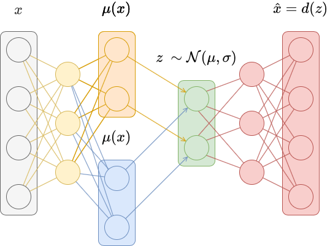

# Variational AutoEncoders (VAE) with PyTorch

## Purpose
Imagine that we have a large, high-dimensional dataset. For example, imagine we have a dataset consisting of thousands of images. Each image is made up of hundreds of pixels, so each data point has hundreds of dimensions. The manifold hypothesis states that real-world high-dimensional data actually consists of low-dimensional data that is embedded in the high-dimensional space. This means that, while the actual data itself might have hundreds of dimensions, the underlying structure of the data can be sufficiently described using only a few dimensions.

This is the motivation behind dimensionality reduction techniques, which try to take high-dimensional data and project it onto a lower-dimensional surface. For humans who visualize most things in 2D (or sometimes 3D), this usually means projecting the data onto a 2D surface. Examples of dimensionality reduction techniques include **principal component analysis (PCA)** and **t-SNE**. Chris Olah’s blog has a great post reviewing some dimensionality reduction techniques applied to the MNIST dataset.

Neural networks are often used in the supervised learning context, where data consists of pairs (x,y)and the network learns a function f:X→Y
. This context applies to both regression (where y is a continuous function of x) and classification (where yis a discrete label for x). However, neural networks have shown considerable power in the unsupervised learning context, where data just consists of points 
x. There are no “targets” or “labels” y. Instead, the goal is to learn and understand the structure of the data. In the case of dimensionality reduction, the goal is to find a low-dimensional representation of the data.

## Autoencoders

Autoencoders are a special kind of neural network used to perform dimensionality reduction. We can think of autoencoders as being composed of two networks, an encoder e and a decoder d.

The encoder learns a non-linear transformation e:X→Z that projects the data from the original high-dimensional input space X to a lower-dimensional latent space Z .

we call z=e(x) a latent vector. A latent vector is a low-dimensional representation of a data point that contains information about x. The transformation e should have certain properties, like similar values of x should have similar latent vectors (and dissimilar values of 
x should have dissimilar latent vectors).

A decoder learns a non-linear transformation d:Z→X that projects the latent vectors back into the original high-dimensional input space X . This transformation should take the latent vector z=e(x) and reconstruct the original input data x=d(z)=d(e(x)).

An autoencoder is just the composition of the encoder and the decoder 
f(x)=d(e(x)). The autoencoder is trained to minimize the difference between the input 
x and the reconstruction x
 using a kind of reconstruction loss. Because the autoencoder is trained as a whole (we say it’s trained “end-to-end”), we simultaneosly optimize the encoder and the decoder.
  

    

## Variational Autoencoders

The only constraint on the latent vector representation for traditional autoencoders is that latent vectors should be easily decodable back into the original image. As a result, the latent space Z can become disjoint and non-continuous. Variational autoencoders try to solve this problem.

In traditional autoencoders, inputs are mapped deterministically to a latent vector 
z=e(x). In variational autoencoders, inputs are mapped to a probability distribution over latent vectors, and a latent vector is then sampled from that distribution. The decoder becomes more robust at decoding latent vectors as a result.

Specifically, instead of mapping the input x to a latent vector z=e(x), we map it instead to a mean vector μ(x) and a vector of standard deviations σ(x). These parametrize a diagonal Gaussian distribution N(μ,σ), from which we then sample a latent vector z∼N(μ,σ).

This is generally accomplished by replacing the last layer of a traditional autoencoder with two layers, each of which output μ(x)and σ(x). An exponential activation is often added to 
σ(x) to ensure the result is positive.

    

## Conclusions

Variational autoencoders produce a latent space Z that is more compact and smooth than that learned by traditional autoencoders. This lets us randomly sample points z∼Z and produce corresponding reconstructions x=d(z) that form realistic digits, unlike traditional autoencoders. 

